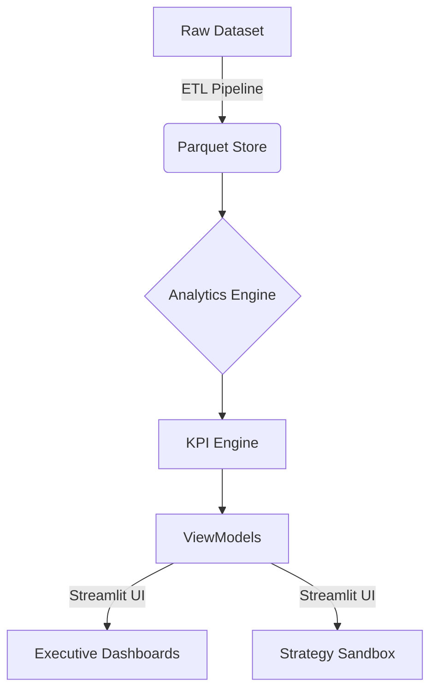
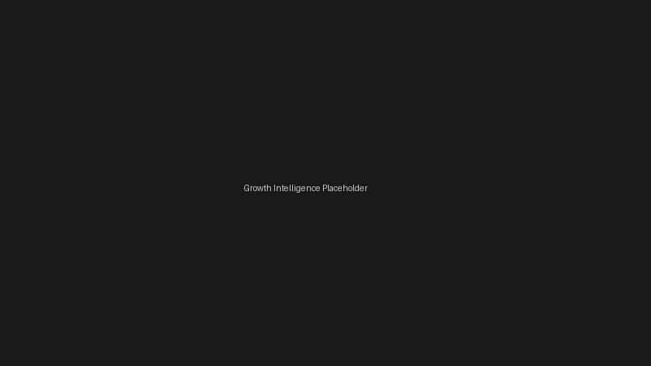

<div align="center">
  

  # Netflix Executive Intelligence Platform (NEIP)

  [](https://python.org)
  [](https://streamlit.io/)
  [](https://plotly.com/)
  [](https://pandas.pydata.org/)
  [](LICENSE)
</div>

<br>

<div align="center">
  
  <p><i>The Executive Intelligence Platform in action.</i></p>
</div>

## 📑 Table of Contents
- [Project Overview](#-project-overview)
- [Business Value](#-business-value)
- [Architecture](#-architecture)
- [Core Modules](#-core-modules)
- [Benchmarks & Performance](#-benchmarks--performance)
- [Screenshots](#-screenshots)
- [Installation](#-installation--deployment)
- [Known Limitations](#-known-limitations)
- [Connect](#-connect)

---

## 📌 Project Overview
The **Netflix Executive Intelligence Platform (NEIP)** is a production-grade, full-stack Business Intelligence application. It replaces static dashboards with a dynamic, metadata-driven decision-making engine. Built to answer specific strategic questions regarding content pacing, global market expansion, and audience retention, the platform strictly follows a Model-View-Controller (MVC) architecture optimized for executive consumption.

## 💼 Business Value
This platform supports high-level executive decisions by providing factual, data-driven insights into the Netflix catalog:
- Monitor **Catalog Growth** and shifting investment from Movies to Premium TV Originals.
- Identify **Market Expansion** opportunities and allocate regional production budgets.
- Evaluate **Content Freshness** and calculate long-term retention risks.
- Compare regional catalogs via **Side-by-Side Market Analysis**.
- Support strategic planning using the **Strategy Sandbox** to simulate catalog elasticity based on historic metadata.

## 🏗️ Architecture



## 🧩 Core Modules

| Module | Business Question |
|--------|-------------------|
| **Executive Overview** | What is the high-level health of our global content library today? |
| **Growth Intelligence** | Has our content strategy shifted from volume acquisition to premium originals? |
| **Market Expansion** | Where should Netflix allocate its next regional production budget? |
| **Content Portfolio** | What is the structural composition and rating focus of our global catalog? |
| **Audience Strategy** | Which genres and formats drive the highest long-term viewer retention? |
| **Compare Markets** | How do content strategies differ between distinct geographic regions? |
| **Strategy Sandbox** | How do targeted content investments impact catalog diversity and freshness? |

## ⚡ Benchmarks & Performance
- **Raw CSV Load Time**: `~1.8s`
- **Parquet Load Time**: `< 300ms` (83% reduction)
- **Memory Footprint**: Reduced by `60%` using PyArrow datatypes.
- **Cache Hits**: `100%` on secondary filtering via `@st.cache_data`.
- **KPIs Monitored**: `32+` across all modules.
- **Engineered Features**: `18` (including duration parsing, age grouping, diversity indices).

## 📸 Screenshots

<details>
<summary><b>1. Executive Overview</b></summary><br>

<i>Immediate strategic alerts and a 5-pillar health scorecard.</i>
</details>

<details>
<summary><b>2. Content Portfolio</b></summary><br>

<i>Deep dive into structural composition and rating focus of the global catalog.</i>
</details>

<details>
<summary><b>3. Growth Intelligence</b></summary><br>

<i>Tracking historical shifts from volume acquisition to premium originals.</i>
</details>

<details>
<summary><b>4. Market Expansion</b></summary><br>

<i>Identifies global production hotspots and under-indexed regions.</i>
</details>

<details>
<summary><b>5. Audience Strategy</b></summary><br>

<i>Format and genre analysis to drive long-term viewer retention.</i>
</details>

<details>
<summary><b>6. Compare Markets</b></summary><br>

<i>Side-by-side benchmarking of regional content strategies.</i>
</details>

<details>
<summary><b>7. Strategy Sandbox</b></summary><br>

<i>Calculates the impact of hypothetical investments on diversity and freshness.</i>
</details>

<details>
<summary><b>8. Insights & Recommendations</b></summary><br>

<i>Rule-based generation of actionable business directives.</i>
</details>

<details>
<summary><b>9. Business Glossary</b></summary><br>

<i>Single source of truth for all formulas and metric definitions.</i>
</details>

## 📂 Folder Structure

```text
Netflix-Executive-Intelligence-Platform/
├── app/
│   ├── components/       # Reusable UI elements (Story Cards, Filters)
│   ├── pages/            # Streamlit dashboard views
│   ├── state/            # Session state and cache management
│   ├── theme/            # CSS tokens and styling injection
│   └── main.py           # Application entry point and sidebar navigation
├── docs/                 # Architecture, Screenshots, and Assets
├── src/
│   ├── analytics_engine/ # Complex aggregation logic
│   ├── config/           # Centralized configuration and design tokens
│   ├── data_pipeline/    # ETL scripts (Cleaning, Feature Engineering)
│   └── kpi_engine/       # Standardized business metric formulas
├── tests/                # Pytest suite (Unit, Integration, UI)
├── .github/workflows/    # CI Pipeline Configurations
├── PROJECT_SHOWCASE.md   # Presentation deck for recruiters
├── DECISIONS.md          # Architectural rationale
├── CHANGELOG.md          
├── ROADMAP.md            
├── README.md             
├── requirements.txt      
└── LICENSE               
```

## 🚀 Installation & Deployment

### Local Setup
1. Clone the repository:
```bash
git clone https://github.com/yourusername/Netflix-Executive-Intelligence-Platform.git
cd Netflix-Executive-Intelligence-Platform
```
2. Install dependencies via Makefile:
```bash
make install
```
3. Run the application:
```bash
make run
```

## ⚠️ Known Limitations
- **No Real-Time API**: Data is sourced from a static Kaggle dataset; it is not hooked into live Netflix production telemetry.
- **Single Dataset Context**: The platform does not incorporate financial, viewership, or churn data, limiting ROI calculations to metadata-driven proxies.
- **No Cloud Warehouse**: Currently leverages a local Parquet file instead of a distributed backend like Snowflake.
- **No Authentication**: The application assumes a trusted internal network and lacks OAuth or RBAC.

## 📄 Resume Highlights
- **Architected** a Netflix Catalog Intelligence platform using Python, Streamlit, and PyArrow, reducing data load times to `<300ms` via Parquet columnar caching.
- **Engineered** an MVC-patterned application separating the UI layer from a highly tested KPI Engine and Analytics Engine.
- **Designed** a "Strategy Sandbox" feature to calculate metadata elasticity and forecast catalog diversity shifts based on simulated production investments.
- **Implemented** a responsive, executive-focused UX design utilizing strict semantic design tokens, Bloomberg-style strategic alerts, and dynamic rule-based text generation.

## 🎯 Interview Preparation (Talking Points)
- **Why Parquet?** "Parquet is a columnar format. Since analytics dashboards usually query specific columns rather than entire rows, Parquet drastically reduces memory overhead and I/O wait times compared to CSV."
- **Why Streamlit?** "Streamlit allows rapid iteration of the presentation layer in pure Python, enabling me to focus my engineering efforts on the backend Analytics Engine rather than managing React state."
- **Why the ViewModel layer?** "It decouples the UI from the data. If the underlying database changes from a Parquet file to Snowflake or BigQuery, the UI code doesn't need a single modification."
- **How did you handle performance?** "I utilized `@st.cache_data` on the ViewModels to prevent re-querying the data pipeline on every UI interaction, guaranteeing near-instant rendering."

## 🔮 Future Scope
- Integration with an LLM (e.g. GPT-4) to power natural language querying for the "Ask the Platform" feature.
- Migrate the backend Parquet data store to a cloud data warehouse (Snowflake / BigQuery).
- Introduce a secure authentication layer via OAuth2.

## 🤝 Connect
- **LinkedIn:** [Your LinkedIn Profile URL]
- **Portfolio:** [Your Portfolio Website URL]
- **Email:** [Your Email Address]
