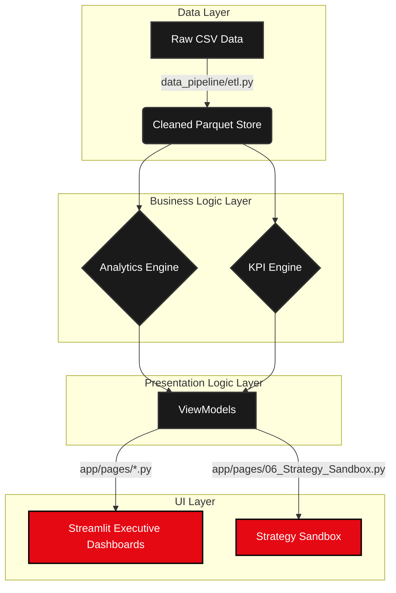

# System Architecture

The **Netflix Executive Intelligence Platform** follows a strict, modular MVC (Model-View-Controller) pattern adapted for Streamlit. The architecture ensures that UI code never directly touches raw data or analytical processing.

## High-Level Data Flow

## Component Breakdown

1. **Data Layer (`src/data_pipeline/`)**: Handles the extraction, cleaning, and feature engineering of the raw dataset, persisting the optimized output to a columnar `.parquet` file for maximum I/O performance.
2. **Analytics & KPI Engine (`src/analytics_engine/`, `src/kpi_engine/`)**: Centralized business logic. Defines all calculations (e.g., `Catalog Freshness`, `Movie to TV Ratio`). Ensures consistency across all UI views.
3. **ViewModels (`app/viewmodels/`)**: Acts as the interface between the Streamlit UI and the Business Logic. Responsible for fetching data, applying global filters, caching the results, and returning cleanly formatted dictionaries to the frontend.
4. **UI Layer (`app/pages/`, `app/components/`)**: The pure presentation layer. Uses design tokens (`src/config/design_tokens.json`) to inject consistent CSS, and imports reusable UI components like `story_card` to render the business data without performing calculations.
